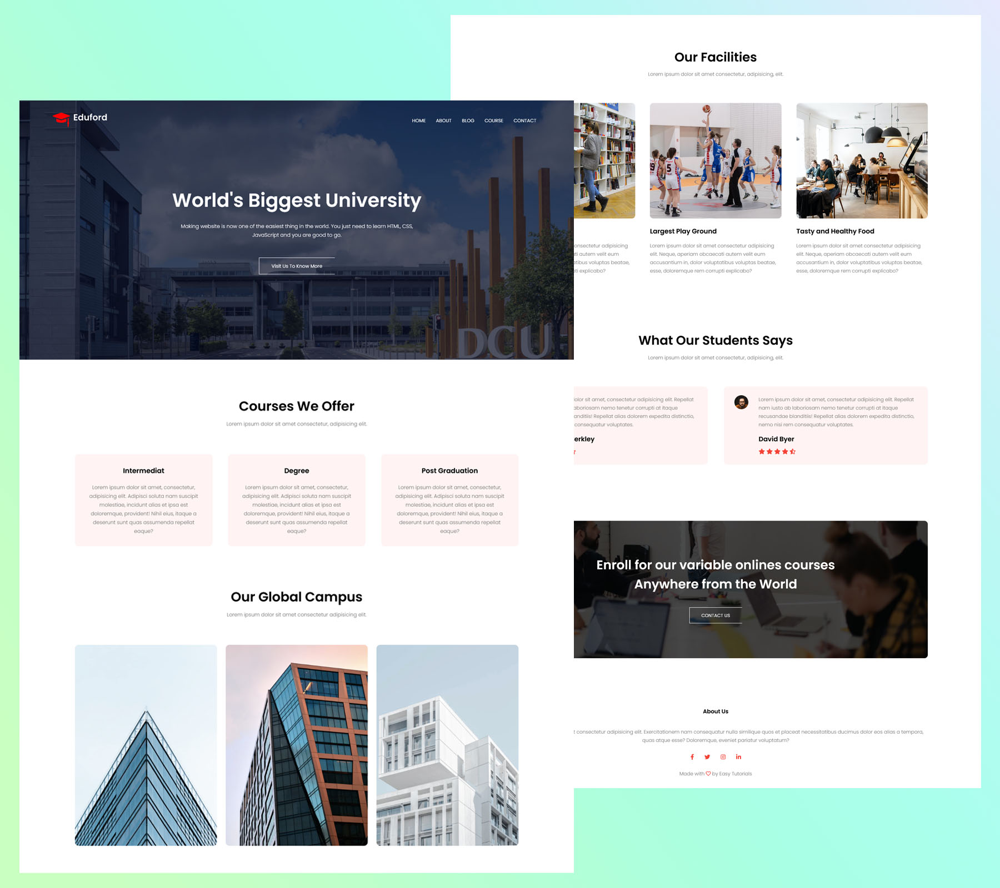
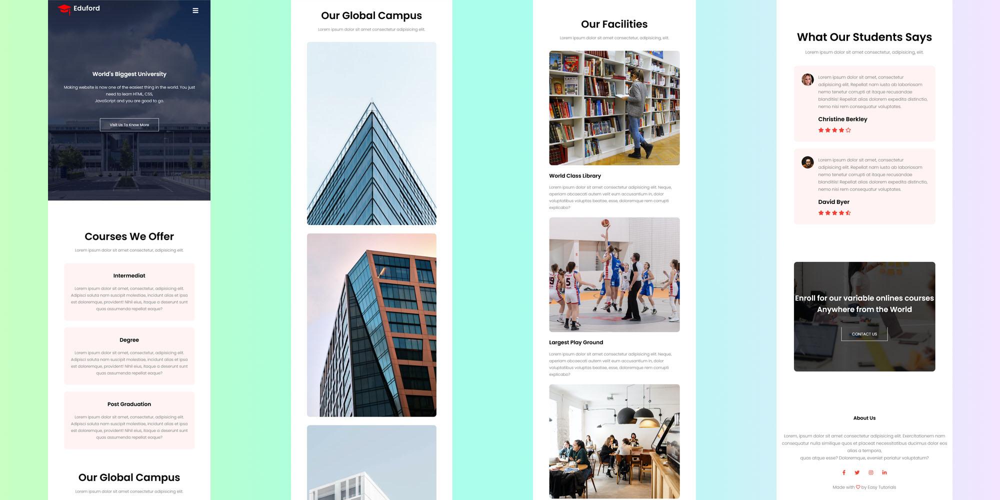

# University

## RWD 切版練習（完整網頁）

這次的切版練習參考了[Easy Tutorials](https://www.youtube.com/watch?v=oYRda7UtuhA)的教學視頻

在這次的練習中，對於建構一個完整的網站以及 RWD 的技巧有了紮實的了解，例如：

- 在手機上的導覽列如何呈現
- `Flex-basis` 及 `Flex-direction` 的運用（透過簡單的微調，就可以呈現 RWD 的部分）
- `Google Font` 及 `Font Awesome` 的使用
- 針對特定的項目可以透過 Class 來做微調（例如按鈕的部分）
- 如何將一個網站上線（雖然這部分沒有實作到，但已經了解該如何做）
- form 表單如何透過後端及來接收資料及回應（php 的部分）

**:avocado:Live Demo: [Here](https://jubeatt.github.io/University)**

## 螢幕截圖

**🖥 桌機版：**

**📱 手機版：**

## 關於作者

- Website - [Jim's blog](https://jubeatt.github.io/)
- Frontend Mentor - [Jim](https://www.frontendmentor.io/profile/jubeatt)
- Facebook - [薛裕正](https://www.facebook.com/profile.php?id=100003593580513)
